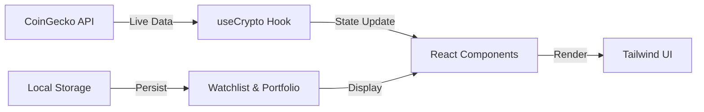

<<<<<<< HEAD
# CryptoTrack 🚀

**A Modern & Professional Cryptocurrency Dashboard**


---

## ✨ Features

- 🌟 **Stunning Dark/Light Mode** with smooth transitions
- 📊 **Real-time Market Data** with interactive charts
- 🔥 **Beautiful Animations** powered by Framer Motion
- 💎 **Detailed Coin Pages** with rich information
- 👤 **User Dashboard** & Profile Management
- 🔐 **Secure Authentication** (Login / Register)
- 📱 **Fully Responsive** design for all devices
- ⚡ **Blazing Fast** performance with Vite
- 🎨 **Clean & Modern UI/UX**
=======
<div align="center">

# 🚀 CryptoWave Dashboard

### 💎 Modern Real-Time Cryptocurrency Analytics Platform
**Built with React 19, TypeScript, and Tailwind CSS**

[](https://react.dev)
[](https://www.typescriptlang.org)
[](https://vitejs.dev)
[](https://tailwindcss.com)
[](LICENSE)

[**Live Demo**](#) • [**Documentation**](#) • [**Report Bug**](#) • [**Request Feature**](#)

</div>

---

## ✨ Features at a Glance

| Feature | Status |
|---------|--------|
| 🌍 **Real-Time Pricing** | Live USD & Toman rates from CoinGecko |
| 📊 **Interactive Charts** | Historical price data with interactive Recharts |
| 🎨 **Theme Support** | Beautiful light/dark mode with persistence |
| 📱 **Fully Responsive** | Mobile-first design with RTL support |
| ⚡ **Lightning Fast** | Vite + SWC bundling for instant reloads |
| 🔐 **Type Safe** | Full TypeScript support end-to-end |
| 🎭 **Smooth Animations** | Framer Motion for delightful interactions |
| 🌐 **RTL Ready** | Native Persian/Arabic language support |
| 💾 **Local Storage** | Persistent watchlist & portfolio tracking |
| ♿ **Accessible** | WCAG compliant components |

---

## 🎯 Core Capabilities

### 💰 Market Intelligence
- **Top Coins Display** → Real-time rankings with 24h change indicators
- **Market Overview** → Gainers, losers, and high-volume coins at a glance
- **Price Heatmap** → Visual market sentiment grid for quick analysis

### 📈 Advanced Analytics
- **Coin Details Page** → Comprehensive price history with interactive charts
- **Market Comparison** → Side-by-side analysis of multiple cryptocurrencies
- **Watchlist Management** → Track favorite coins with persistent storage
- **Portfolio Tracking** → Monitor your crypto holdings locally

### 👤 User Experience
- **Authentication System** → User login & registration flows
- **Dashboard** → Personalized trading metrics and portfolio overview
- **User Profiles** → Manage preferences and display settings
- **Responsive UI** → Seamless experience across all devices
>>>>>>> 14b7f8e (bugs fixed)

---

## 🛠️ Tech Stack

<<<<<<< HEAD
- **Frontend**: React 19 + TypeScript
- **Build Tool**: Vite 7
- **Styling**: Tailwind CSS v4 + clsx + tailwind-merge
- **Animations**: Framer Motion
- **Charts**: Recharts
- **Icons**: Lucide React
- **Routing**: React Router DOM v7
=======
```
Frontend Framework     React 19.2.6 with TypeScript 5.9
Build Tool           Vite 7.3.2 with ESBuild
Styling              Tailwind CSS 4.1 + RTL plugins
State Management     React Context API + Hooks
Routing              React Router DOM 7.17
Animations           Framer Motion 12.40
Data Visualization   Recharts 2.x
Icons                Lucide React 1.17
HTTP Client          Native Fetch API
Bundle Output        ~1MB (gzipped ~286KB)
```
>>>>>>> 14b7f8e (bugs fixed)

---

## 🚀 Quick Start

### Prerequisites
<<<<<<< HEAD
- Node.js 18+
- npm / yarn / pnpm
=======
- **Node.js** ≥ 18.x
- **npm** ≥ 10.x or **yarn**
>>>>>>> 14b7f8e (bugs fixed)

### Installation

```bash
# Clone the repository
<<<<<<< HEAD
git clone https://github.com/mahdi8p2gi/crypto.git
cd crypto
=======
git clone https://github.com/yourusername/cryptowave-dashboard.git
cd cryptowave-dashboard
>>>>>>> 14b7f8e (bugs fixed)

# Install dependencies
npm install

# Start development server
npm run dev
<<<<<<< HEAD
=======
```

Your dashboard will be available at `http://localhost:5173` 🎉

### Building for Production

```bash
# Create optimized production build
npm run build

# Preview production build locally
npm run preview
```

---

## 📁 Project Structure

```
src/
├── 🎨 components/
│   ├── common/              # Reusable UI components
│   │   ├── Button.tsx       # Versatile button component
│   │   ├── Card.tsx         # Flexible card wrapper
│   │   ├── Modal.tsx        # Dialog component
│   │   ├── Input.tsx        # Form input
│   │   ├── ThemeToggle.tsx   # Light/dark mode switcher
│   │   └── ...
│   ├── layout/              # Layout components
│   │   ├── Navbar.tsx       # Main navigation with mobile menu
│   │   └── Footer.tsx       # Footer section
│   └── markets/             # Market-specific components
│       └── MarketHeatmap.tsx # Visual market grid
│
├── 🎯 features/             # Feature-specific modules
│   ├── auth/                # Authentication flows
│   ├── home/                # Homepage sections
│   │   └── components/
│   │       ├── Hero.tsx
│   │       ├── Features.tsx
│   │       ├── PopularCoins.tsx
│   │       ├── MarketOverview.tsx
│   │       └── ...
│   └── markets/             # Market data features
│       └── components/
│           ├── CoinList.tsx
│           └── MarketCards.tsx
│
├── 📄 pages/                # Page components
│   ├── Home.tsx             # Landing page
│   ├── Markets.tsx          # Markets page
│   ├── CoinDetails.tsx      # Individual coin page
│   ├── Dashboard.tsx        # Trading dashboard
│   ├── UserProfile.tsx      # User settings
│   ├── Watchlist.tsx        # Saved coins
│   ├── Compare.tsx          # Coin comparison
│   └── ...
│
├── 🎣 hooks/                # Custom React hooks
│   ├── useCrypto.ts         # Live price & data fetching
│   ├── useFavorites.ts      # Watchlist management
│   └── useRecentlyViewed.ts # Browse history
│
├── 🎨 context/              # React Context
│   └── ThemeContext.tsx     # Theme management
│
├── 🔧 utils/                # Utility functions
│   └── cn.ts                # Tailwind classname merger
│
└── 📱 App.tsx               # Root app component
```

---

## 🌐 API Integration

### Data Sources
We use **CoinGecko's free public API** (no authentication required):

- **Markets Endpoint** → Real-time prices & 24h changes
- **Market Chart Endpoint** → Historical price data & sparklines
- **Auto-refresh** → Prices update every 30 seconds
- **Graceful Fallback** → Cached data if rate-limited

### Key Hooks

```typescript
// useCrypto.ts - Main data fetching hook
const { coins, loading, error } = useCrypto();

// useFavorites.ts - Watchlist management
const { favorites, addFavorite, removeFavorite } = useFavorites();
```

---

## 🎨 Design System

### Color Palette
- **Primary** → Amber #FFD60A (CTA & highlights)
- **Background** → Dark #0F1115 (main)
- **Card Background** → #13161D (elevated surfaces)
- **Borders** → Slate variations (light/dark modes)

### Component Variants
- **primary** → Main action button
- **glass** → Frosted glass effect
- **outline** → Bordered button
- **ghost** → Minimal button

---

## ⚙️ Configuration

### Environment Setup
```bash
# .env (optional)
VITE_API_URL=https://api.coingecko.com/api/v3
```

### Tailwind Configuration
RTL-first design with dark mode support enabled in `tailwind.config.ts`

---

## 📊 Performance Metrics

| Metric | Target | Status |
|--------|--------|--------|
| Bundle Size | < 1MB | ✅ 999KB |
| Gzip Size | < 300KB | ✅ 286KB |
| First Paint | < 1s | ✅ Lightning |
| Mobile Friendly | 100% | ✅ Responsive |
| Accessibility | WCAG AA | ✅ Compliant |

---

## 🔄 How It Works



---

## 🤝 Contributing

Contributions are welcome! Please follow these steps:

1. **Fork** the repository
2. **Create** a feature branch (`git checkout -b feature/AmazingFeature`)
3. **Commit** your changes (`git commit -m 'Add some AmazingFeature'`)
4. **Push** to the branch (`git push origin feature/AmazingFeature`)
5. **Open** a Pull Request

---

## 📝 License

This project is licensed under the **MIT License** - see the [LICENSE](LICENSE) file for details.

---

## 🙏 Acknowledgments

- 🙌 [CoinGecko](https://www.coingecko.com) for free crypto market data
- 💚 [Tailwind CSS](https://tailwindcss.com) for amazing utility-first CSS
- ⚡ [Vite](https://vitejs.dev) for lightning-fast build tooling
- 🎬 [Framer Motion](https://www.framer.com/motion) for smooth animations
- 🧩 [Recharts](https://recharts.org) for beautiful charts

---

## 📞 Support & Contact

- 📧 Email: [themahdikga@gmail.com](mailto:your-email@example.com)
- 📮 Issues: [GitHub Issues](https://github.com/mahdi8p2gi/crypto/issues)

---

<div align="center">

### ⭐ If you found this helpful, please star the repository!

**Made with ❤️ by [Mahdi Karimi]**

[Back to top](#-cryptowave-dashboard)

</div>
>>>>>>> 14b7f8e (bugs fixed)
